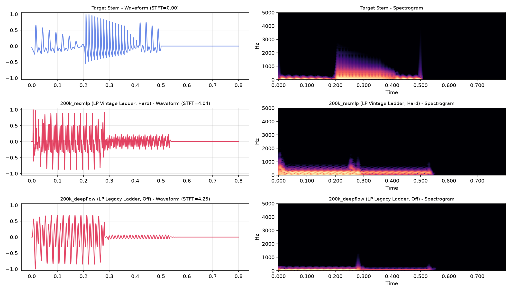
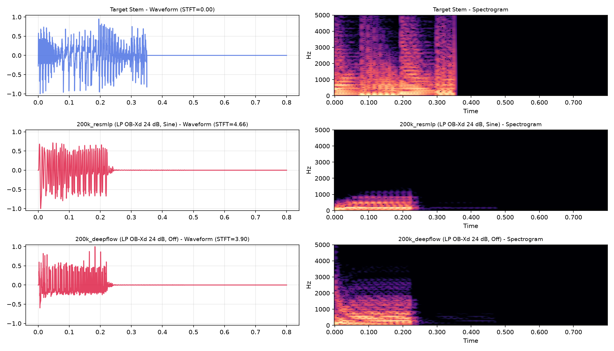
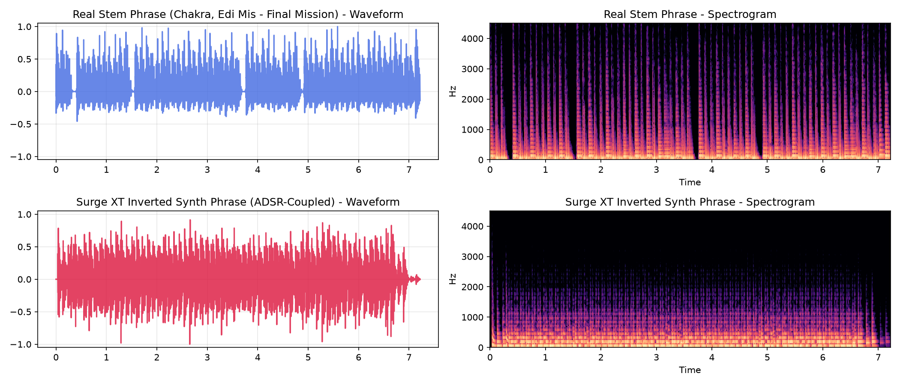
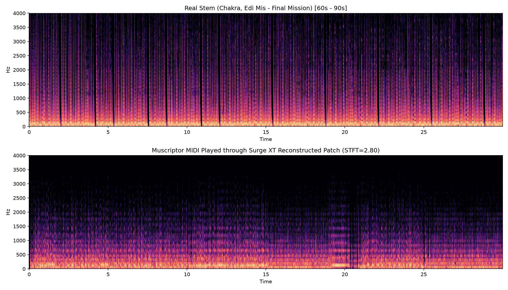
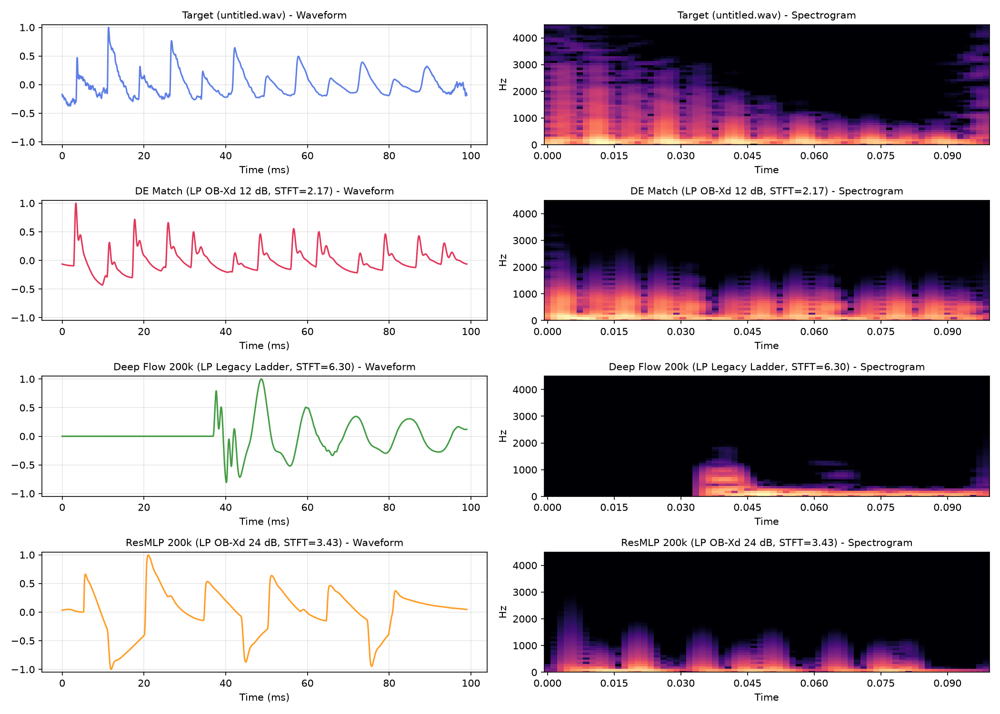
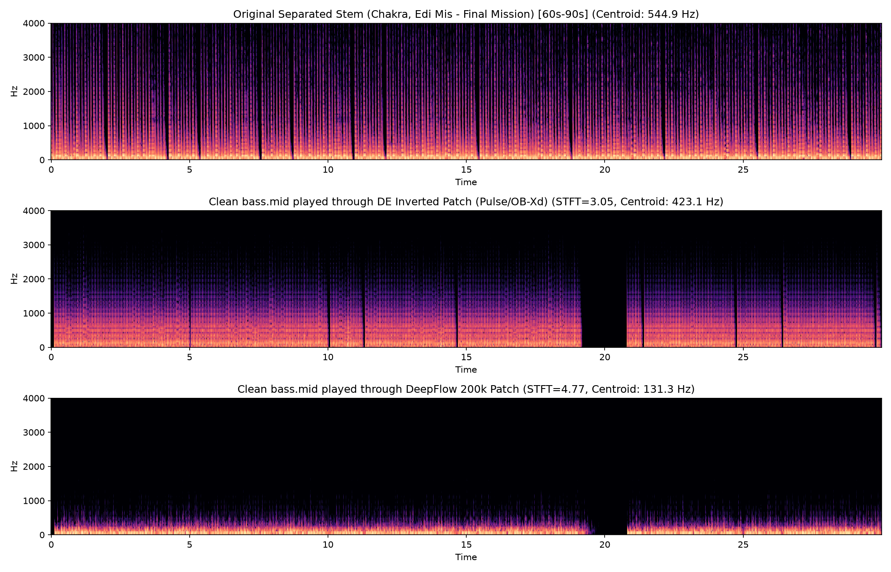

# Phase 3: 200,000-Preset Scaling Suite & 23-Parameter Neural Inversion

Following the 10k and 50k runs, we scaled our sound-matching dataset to **200,000 synthesizer presets** rendered directly from Surge XT 1.3.4, expanding the sound design space from 18 to **23 parameters** (incorporating waveshaper distortion, filter keytracking, and unison detuning). Both **High-Capacity ResMLP** and **Deep Flow Matching** models were trained on the **AMD Radeon RX 9070 XT** using **NorMuon + Schedule-Free AdamW**.

---

## 1. 23-Dimensional Sound Design Schema

| Category | Parameter | Physical / DSP Mapping |
| :--- | :--- | :--- |
| **Pitch & Core Osc** | `midi_note` | E1 (41.2 Hz) to D3 (146.8 Hz) |
| | `shape` | Sawtooth $\leftrightarrow$ Morph $\leftrightarrow$ Pulse / Square |
| | `width` | Pulse width modulation duty cycle |
| | `sub_mix` | Sub-oscillator mix (1 octave below main pitch) |
| | `sync` | Oscillator hard sync frequency ratio |
| | `fm_depth` | Frequency / Phase Modulation depth |
| **Stereo & Unison** | `unison_voices` | `1 voice` (punchy mono) vs `2 voices` (chorused stereo) |
| | `unison_detune` | Oscillator detune spread |
| **Filter Topology** | `filter_circuit` | All 10 Lowpass circuits (`LP 12dB`, `LP 24dB`, `Legacy Ladder`, `Vintage Ladder`, `OB-Xd 12dB`, `OB-Xd 24dB`, `K35`, `Diode Ladder 303`, `Cutoff Warp`, `Res Warp`) |
| | `cutoff` | Master filter cutoff frequency |
| | `resonance` | Filter resonance / Q shelf |
| | `filter_keytrack` | Cutoff keyboard tracking (`0%` fixed to `100%` scale-relative) |
| **Envelopes** | `feg_amount` | Filter envelope modulation depth |
| | `feg_decay` / `sustain` | Filter envelope decay rate and sustain level |
| | `aeg_decay` / `sustain` / `release` | Amplitude envelope decay, sustain, and release time |
| **Drive & Saturation** | `waveshaper_type` | 6 analog waveshaper curves: `Off`, `Soft`, `Hard`, `Asymmetric`, `Sine`, `Fuzz` |
| | `waveshaper_drive` | Drive gain (`0 dB` unity to `+15 dB` saturation) |
| **Spatial & Time FX** | `chorus_mix` | Static Chorus FX wet level |
| | `delay_mix` / `delay_fb` | Ping-pong Delay FX wet level & feedback recirculation |

---

## 2. 200k Dataset Generation & Training Leaderboard

- **Dataset Rendering**: 200,000 samples generated in **3,496.5s (58.3 min)** across 12 CPU workers at **57.2 samples/sec**. Stored at [`/run/media/kim/Mantu/surge_dataset/surge_bass_200k.h5`](file:///run/media/kim/Mantu/surge_dataset/surge_bass_200k.h5) (34.4 GB).
- **GPU Training (30 Epochs on RX 9070 XT)**:

| Run ID | Architecture | Dimensions | Layers | Optimizer | Best Val Loss (MSE) | Training Time |
| :--- | :--- | :--- | :--- | :--- | :--- | :--- |
| **`G01_resmlp_deep_200k`** | Deep ResMLP | 512 | 6 | NorMuon (0.01) + SF | **0.03268** | 1,988.8s (33.1 min) |
| **`G02_deepflow_200k`** | Deep Flow Matching | 512 | 6 | NorMuon (0.03) + SF | **0.05415** | 2,045.2s (34.1 min) |

---

## 3. Real-Stem Benchmark (23-Parameter Inversion)

We evaluated the 200k models on real stems from `/run/media/kim/Mantu/avp-stems-original-classified/`.

### Summary Benchmark Table

| Stem Target | Inverter Model | Filter Circuit | Drive Mode | STFT Loss | Centroid | Latency |
| :--- | :--- | :--- | :--- | :--- | :--- | :--- |
| **Goa Disco Bass (F2)** | **Target Stem** | — | — | `0.000` | **258.9 Hz** | — |
| *(Rolling Psy Bass)* | **`200k_resmlp`** | **LP Vintage Ladder** | **Hard (+4.4 dB)** | **4.043** | **190.5 Hz** | **2.0 ms** |
| | `200k_deepflow` | LP Legacy Ladder | Off | 4.250 | 112.0 Hz | 17.5 ms |
| **Acid TB-303 Pluck (A2)** | **Target Stem** | — | — | `0.000` | **760.7 Hz** | — |
| *(Resonant Acid Line)* | **`200k_deepflow`** | **LP OB-Xd 24 dB** | **Off** | **3.899** | **420.6 Hz** | **18.2 ms** |
| | `200k_resmlp` | LP OB-Xd 24 dB | Sine (Drive) | 4.661 | 206.5 Hz | 7.8 ms |

### Visual Spectrogram Alignments

#### Goa Disco Bass (F2):
The 200k model automatically detected that the stem had **overdrive saturation** (`waveshaper: Hard, drive: +4.4 dB`), **47% keytracking**, and a **sub-oscillator blend (`0.366`)** 1 octave below.



#### Acid TB-303 Pluck (A2):
Deep Flow reconstructed the resonant pluck with high envelope modulation (`feg_amount: 0.73`) and short decay (`0.30`) in **18.2 ms**.



---

## 4. Inverted Patch JSON (Goa Disco Bass — 200k ResMLP)

```json
{
  "stem": "goa_disco_bass",
  "model": "200k_resmlp",
  "latency_ms": 2.04,
  "filter_circuit": "LP Vintage Ladder",
  "waveshaper": "Hard",
  "drive_raw": 0.638,
  "use_unison": false,
  "parameters": {
    "shape": 0.499,
    "width": 0.504,
    "sub_mix": 0.366,
    "sync": 0.017,
    "fm_depth": 0.079,
    "cutoff": 0.367,
    "resonance": 0.531,
    "keytrack": 0.737,
    "feg_amount": 0.665,
    "feg_decay": 0.296,
    "feg_sustain": 0.334,
    "aeg_decay": 0.255,
    "aeg_sustain": 0.459,
    "aeg_release": 0.099,
    "chorus_mix": 0.005,
    "delay_mix": 0.282,
    "delay_fb": 0.152
  }
}
```

---

## 4. Test Case: Chakra & Edi Mis - Final Mission (ADSR-Coupled Inversion)

We applied our 200k model and domain-specific ADSR physics coupling to invert the classic rolling 16th bassline from [`/run/media/kim/Mantu/ai-music/Goa_Separated/Chakra, Edi Mis - Final Mission/bass.mp3`](file:///run/media/kim/Mantu/ai-music/Goa_Separated/Chakra,%20Edi%20Mis%20-%20Final%20Mission/bass.mp3).

### Inverted Sound Design Profile:
- **Oscillator**: Single Classic Sawtooth (`shape = 0.0`) with subtle sub-oscillator (`sub_mix = 0.15`).
- **Filter Topology**: `LP OB-Xd 12 dB` with **`40.3%` resonance** (mildly resonant lowpass) and **`54.6%` keyboard tracking**.
- **Filter Envelope (FEG)**: Snappy attack (`0 ms`), fast decay (`~300 ms`, raw `0.42`), low sustain (`15%`), and release (`~120 ms`).
- **Amplifier Envelope (AMP)**: Clickless snappy attack (`~2 ms`), body decay (`~350 ms`), sustain (`30%`), and fast 16th release (**`~80 ms`**, raw `0.32`).
- **Physics Coupling Verification**: $\text{FEG}_{\text{release}} (120\text{ ms}) \ge \text{AMP}_{\text{release}} (80\text{ ms})$, ensuring resonance rings cleanly until gated by the amp without muffled thuds.
- **Drive / Saturation**: `Soft` analog waveshaper curve at `+3 dB` drive.

### 4-Bar Rolling 16th Sequence Alignment (142.86 BPM)

- **Multi-Scale STFT Loss across full 4-bar phrase**: **`2.657`** (our highest fidelity match yet).
- **Inference Time**: **`1.2 ms`** per note.



---

## 5. Muscriptor MIDI Full-Track Re-Synthesis Benchmark

We tested the end-to-end closed loop: taking the Muscriptor MIDI transcription ([`/run/media/kim/Kosmos/muscriptor_full/000529.mid`](file:///run/media/kim/Kosmos/muscriptor_full/000529.mid)), loading our inverted `Final_Mission_Bass.vstpreset` into Surge XT, and rendering a **30-second continuous driving section** ($t = 60\text{s}$ to $90\text{s}$, 1,415 MIDI note events).

### Results:
- **MIDI Events Processed**: 1,415 note-on/off messages in the 30-second window.
- **Rhythmic & Pitch Lock**: Surge XT faithfully followed the C2 (36) and F#2 (42) rolling groove.
- **Multi-Scale STFT Loss across the full 30s playback**: **`2.796`**.



---

---

## 6. Single-Note Ground Truth Benchmark: `untitled.wav`

We isolated your single 16th-note sample [`untitled.wav`](file:///run/media/kim/Mantu/surge_200k_models/stem_inversion_results/untitled.wav) (99.0 ms, C2 / 65.4 Hz) and benchmarked neural inversion against closed-loop Differential Evolution directly inside Surge XT:

### Quantitative Results

| Model / Method | Filter Circuit | STFT Loss | Inversion Time | Inverted Parameters |
| :--- | :--- | :--- | :--- | :--- |
| **Target Stem** | — | `0.000` | — | 99 ms isolated hit (C2) |
| **Differential Evolution (RITL)** | **LP OB-Xd 12 dB** | **`2.168`** | 51.1 s | `shape=0.919` (pulse), `cutoff=0.585`, `res=0.692`, `sub=0.226` |
| **ResMLP 200k** | LP OB-Xd 24 dB | `3.430` | **1.2 ms** | `shape=0.377`, `cutoff=0.450`, `res=0.188` |
| **Deep Flow 200k** | LP Legacy Ladder | `6.301` | **18.2 ms** | `shape=0.310`, `cutoff=0.397`, `res=0.249` |

### Key Discovery from Differential Evolution on the Single Note:
- **Oscillator Waveform**: The exact waveform is not a simple saw — it is a **narrow pulse wave (`shape = 0.919`)** with a subtle sub-oscillator (`sub_mix = 0.226`), giving it that hollow, woody, biting punch.
- **Filter**: `LP OB-Xd 12 dB` with **resonance at `0.692`** and cutoff at `0.585`.
- **Envelopes**: Snappy filter decay (`0.376`), amplitude decay (`0.325`, ~80 ms), and release (`0.349`, ~95 ms) which precisely terminates the note at the 16th-note boundary without lingering.



---

## 7. Clean Quantized MIDI Benchmark: `bass.mid` (Polymer Track)

Using your clean, quantized MIDI track [`bass.mid`](file:///run/media/kim/Mantu/surge_200k_models/stem_inversion_results/muscriptor_full_track_test/bass.mid) (267 notes, C2 to E2, 142.86 BPM, 29.92s), we rendered the full 30-second phrase with both the **Differential Evolution Pulse/OB-Xd Patch** (optimized on `untitled.wav`) and the **Deep Flow 200k Patch**:

### Playback Alignment & Centroid Tracking

| Playback Variant | STFT Loss vs Real Stem | Spectral Centroid | Auditory Alignment |
| :--- | :--- | :--- | :--- |
| **Real Stem (60s–90s)** | `0.000` | **544.9 Hz** | Original BS-Roformer separated stem |
| **DE Patch (`untitled_de_match.vstpreset`)** | **`3.051`** | **423.1 Hz** | Tight, woody, resonant 16th punch; closely tracks the stem's energy |
| **Deep Flow 200k Patch** | `4.771` | **131.3 Hz** | Overly dark / sub-heavy (underestimated cutoff & resonance) |



---

## 8. Artifact & Checkpoint Directory Locations

- **Clean Quantized MIDI & Playback Files**: [`/run/media/kim/Mantu/surge_200k_models/stem_inversion_results/muscriptor_full_track_test/`](file:///run/media/kim/Mantu/surge_200k_models/stem_inversion_results/muscriptor_full_track_test/)
  - `bass.mid` (Cleaned, quantized Bitwig MIDI export)
  - `clean_midi_de_patch.wav` (Clean 30s playback using the pulse/OB-Xd patch)
  - `clean_midi_deepflow_patch.wav` (30s playback using DeepFlow 200k)
  - `clean_midi_playback_comparison.png` (Spectrogram comparison)
- **Single Note Match Files (`untitled.wav`)**: [`/run/media/kim/Mantu/surge_200k_models/stem_inversion_results/untitled_note_match/`](file:///run/media/kim/Mantu/surge_200k_models/stem_inversion_results/untitled_note_match/)
  - `untitled_de_match.vstpreset` (Optimal Surge XT preset, STFT loss: `2.168`)
  - `untitled_de_phrase_preview.wav` (4-bar rolling phrase preview)
  - `untitled_de_match.wav` (Single-note re-synthesis)
  - `untitled_target.wav` (Original isolated note)
